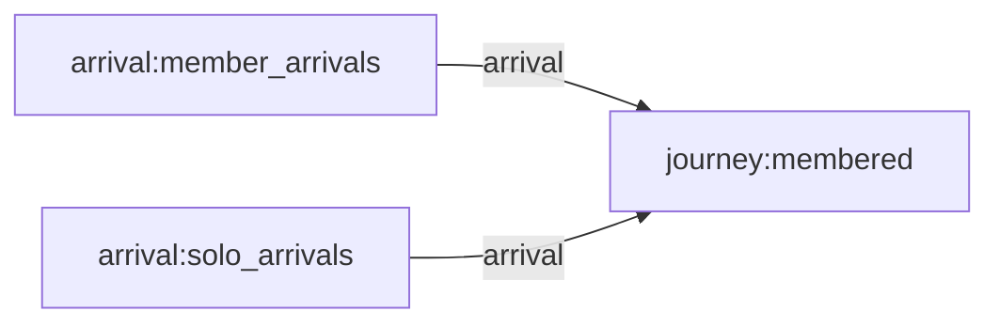
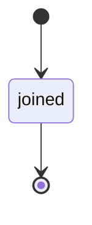

# Minimal parent/child (membership) dataset. Five groups exist from the start; members arrive over a short horizon and join one group for life, chosen uniformly at creation. A rare second arrival stream mints members with no group at all, so consumers see honest NULL membership. Built for downstream consumers learning how a membership reference reads in the base layer.

## Flow

## Types
- **actor.member** — The child record. Joins exactly one group at creation via the immutable group reference — or none at all, for the rare group-less arrivals. Its projected email borrows the joined group's domain.
- **entity.group** — The parent record. Carries no mechanism traits — it exists to be referenced; its rendered name and email domain are minted at presentation time and shared with every member that joins it.

## Resources
_None declared._

## Journeys
- **membered** — Bookkeeping journey — every arrival lands in a single terminal state. Membership itself is assigned at creation by the arrival stream, not by journey behavior.
  - **joined** — Terminal landing state; the member stays active.

## Influence Rules
_None declared._

## Arrival Streams
- **member_arrivals** — Membered arrivals — each new member picks one group uniformly at creation; membership is assigned here, once, for life.
- **solo_arrivals** — Group-less arrivals — members minted without a group reference. Their NULL membership flows honestly through to the projected email.
- **group_arrivals** — Groups founded mid-run — joinable by any member arriving after them. Founded groups carry hex-digest record ids, so record ids are visibly opaque strings, never ordinals.

## Events
_None declared._
