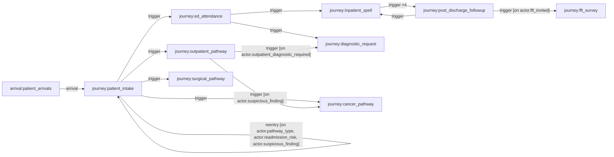
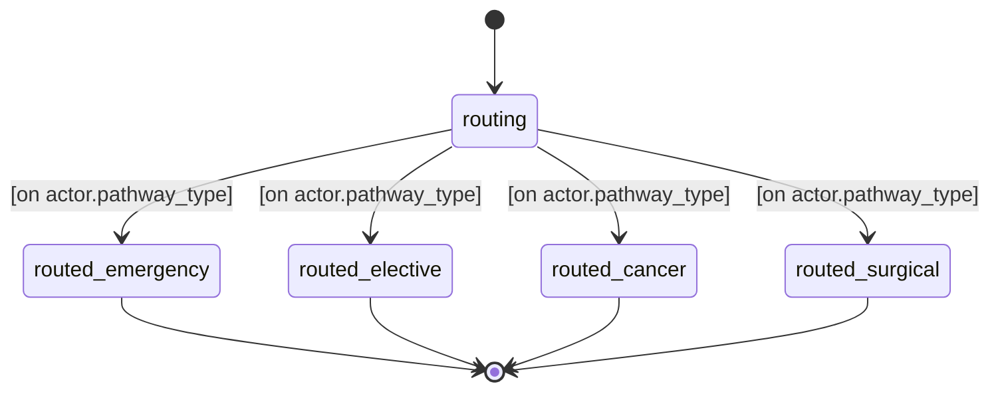
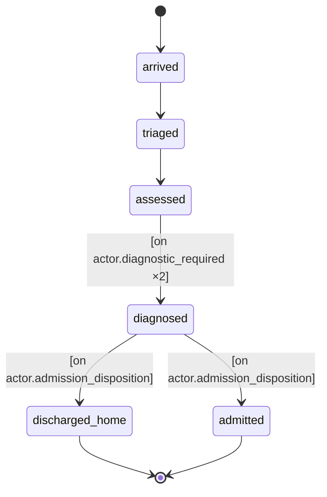
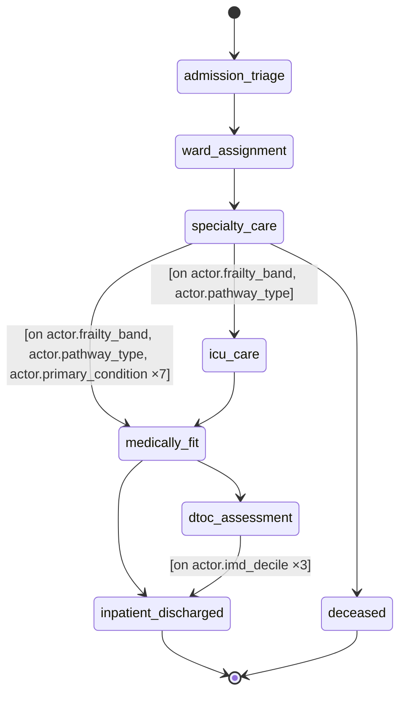
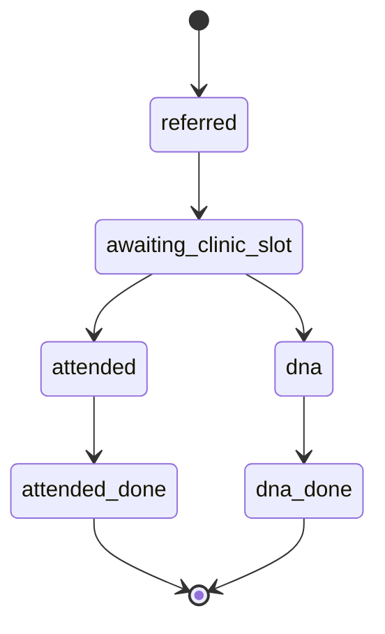
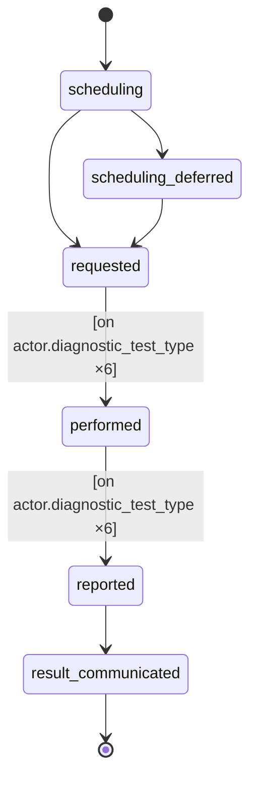
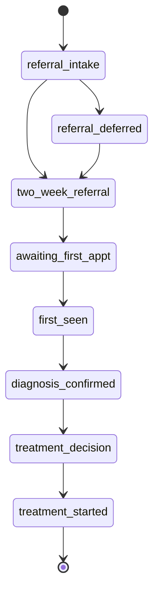
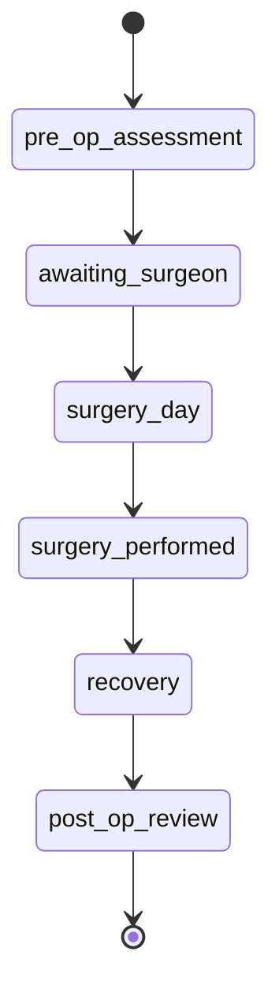
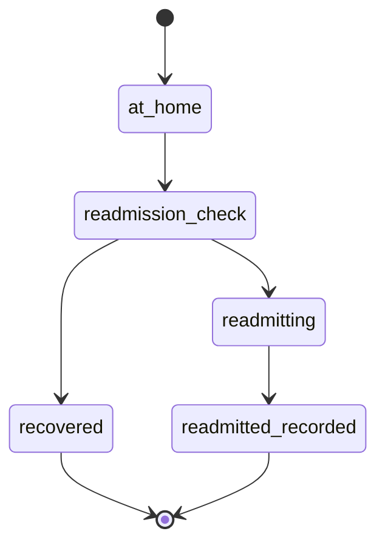
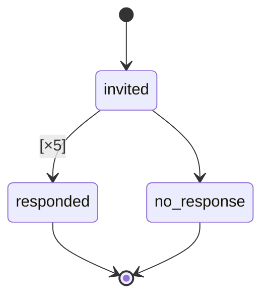

# An acute NHS hospital trust: emergency and elective patients flow from a single arrivals stream through A&E, inpatient wards, outpatient clinics, diagnostics, cancer and surgical pathways, then post-discharge follow-up — competing for consultants, beds, theatres and clinic slots under seasonal demand pressure.

## Flow

## Types
- **actor.default** — A patient of the trust — carries demographics (deprivation decile, ethnicity), clinical attributes (primary condition, frailty, comorbidities) and pathway flags that steer them through the care pathways.
- **resource.consultant** — A senior doctor with finite capacity, deliberately split by pathway: ward admissions gate themselves below full capacity to hold slots back for clinic and theatre work, so an inpatient side that plateaus short of the declared capacity is the specialty running full. Consultants of the same specialty share one priority queue, and a saturated specialty queues its patients by clinical priority.
- **entity.ward** — An inpatient ward with a bed count and a ward type (general, assessment, ICU/HDU, step-down) that stratifies safety-incident risk.
- **entity.theatre** — An operating theatre, with a specialty and a number of operating sessions per day.
- **entity.diagnostic** — A diagnostic test type (X-ray, CT, MRI, bloods, ECG, ultrasound and others) with a typical turnaround and cost.
- **entity.procedure** — A surgical procedure in the catalogue, coded by OPCS-4 with an HRG case-mix bucket, national tariff and complexity band.
- **entity.medication** — A medication in the formulary, grouped by drug class and specialty.
- **diary.outpatient_clinic** — A per-specialty outpatient clinic appointment book. The wait for a routine slot emerges from how fast referrals arrive against a fixed supply of openings.
- **diary.cancer_clinic** — A per-specialty two-week-wait cancer clinic book for urgent suspected-cancer referrals; the 2WW wait is the booking lead-time.
- **diary.operating_list** — A per-specialty elective operating-list book; the wait for surgery emerges from scarce theatre-list openings.

## Resources
- **resource.consultant** _(pool)_ — A senior doctor with finite capacity, deliberately split by pathway: ward admissions gate themselves below full capacity to hold slots back for clinic and theatre work, so an inpatient side that plateaus short of the declared capacity is the specialty running full. Consultants of the same specialty share one priority queue, and a saturated specialty queues its patients by clinical priority.
  - partition: main_specialty — 110, 180, 300, 301, 320, 340
  - seized by: ed_attendance.arrived (tick), inpatient_spell.admission_triage (tick), surgical_pathway.surgery_day (tick)
- **diary.outpatient_clinic** _(diary)_ — A per-specialty outpatient clinic appointment book. The wait for a routine slot emerges from how fast referrals arrive against a fixed supply of openings.
  - booked by: outpatient_pathway.awaiting_clinic_slot (tick)
- **diary.cancer_clinic** _(diary)_ — A per-specialty two-week-wait cancer clinic book for urgent suspected-cancer referrals; the 2WW wait is the booking lead-time.
  - booked by: cancer_pathway.awaiting_first_appt (tick)
- **diary.operating_list** _(diary)_ — A per-specialty elective operating-list book; the wait for surgery emerges from scarce theatre-list openings.
  - booked by: surgical_pathway.awaiting_surgeon (tick)

## Journeys
- **patient_intake** — Front-door triage that routes each new arrival to the right pathway — emergency, elective outpatient, cancer or surgical — by pathway type.
  - **routing** — Newly arrived patient awaiting routing to a care pathway.
  - **routed_emergency** — Routed to the emergency (A&E) pathway.
  - **routed_elective** — Routed to the elective outpatient pathway.
  - **routed_cancer** — Routed to the suspected-cancer pathway.
  - **routed_surgical** — Routed to the elective surgical pathway.

- **ed_attendance** — An A&E (emergency department) attendance: arrival, triage, assessment, diagnosis, then either discharge home or admission to a ward.
  - **arrived** — Arrived in A&E, waiting for an emergency doctor to triage them.
  - **triaged** — Triaged in A&E; awaiting clinical assessment.
  - **assessed** — Assessed by the emergency team; awaiting a diagnosis and any diagnostic tests.
  - **diagnosed** — Diagnosed in A&E; a decision is made to discharge home or admit.
  - **discharged_home** — Discharged home from A&E.
  - **admitted** — Admitted from A&E to an inpatient bed.

- **inpatient_spell** — An inpatient hospital stay from admission through ward care (and possible ICU escalation or death) to medically-fit, any delayed transfer of care, and discharge.
  - **admission_triage** — Admitted patient being booked in and matched to a specialty consultant, waiting if the specialty is full.
  - **ward_assignment** — Allocated to an inpatient ward.
  - **specialty_care** — Receiving specialty inpatient care; length of stay varies by condition, with a daily risk of a safety incident and a frailty-driven risk of death.
  - **icu_care** — Escalated to intensive care for the sickest patients.
  - **medically_fit** — Declared medically fit for discharge; either discharged or held for a delayed transfer of care.
  - **dtoc_assessment** — Medically fit but waiting for community or social care to be arranged (a delayed transfer of care); the wait lengthens with deprivation.
  - **inpatient_discharged** — Discharged from the inpatient ward.
  - **deceased** — Died in hospital during the inpatient stay.

- **outpatient_pathway** — An elective outpatient referral: wait for a clinic appointment, then either attend or do-not-attend (DNA).
  - **referred** — Referred by a GP to an outpatient clinic.
  - **awaiting_clinic_slot** — On the waiting list for a clinic appointment, with a daily risk of deteriorating while waiting.
  - **attended** — Attended the outpatient appointment.
  - **dna** — Did not attend (DNA) the booked appointment, wasting the slot.
  - **attended_done** — Outpatient episode complete after attending.
  - **dna_done** — Outpatient episode closed after a missed appointment.

- **diagnostic_request** — A diagnostic test order running alongside an A&E or outpatient episode: scheduling, the test being performed, reported, and the result communicated.
  - **scheduling** — Diagnostic test being scheduled.
  - **scheduling_deferred** — Test scheduling deferred into a backlog before being ordered.
  - **requested** — Test ordered; awaiting the test to be performed (turnaround varies by modality).
  - **performed** — Test performed; awaiting the report.
  - **reported** — Test reported; result being communicated.
  - **result_communicated** — Diagnostic result communicated to the requesting team.

- **cancer_pathway** — A suspected-cancer pathway on the two-week-wait standard: referral, first appointment, diagnosis, treatment decision and start of treatment, tracked against the 62-day target.
  - **referral_intake** — Urgent cancer referral being processed.
  - **referral_deferred** — Cancer referral held in a backlog before proceeding.
  - **two_week_referral** — Two-week-wait referral made; awaiting a first specialist appointment.
  - **awaiting_first_appt** — Waiting for the first two-week-wait clinic appointment.
  - **first_seen** — Seen by the specialist for the first time.
  - **diagnosis_confirmed** — Cancer diagnosis confirmed.
  - **treatment_decision** — Treatment decision made (decision-to-treat).
  - **treatment_started** — Cancer treatment started.

- **surgical_pathway** — An elective surgical pathway: pre-operative assessment, wait for an operating-list slot, the operation itself, and recovery to post-op review.
  - **pre_op_assessment** — Pre-operative assessment; the procedure is planned and the patient is listed for surgery.
  - **awaiting_surgeon** — On the elective waiting list for an operating-list slot.
  - **surgery_day** — Day of surgery; a specialty surgeon is taken for the operation.
  - **surgery_performed** — Operation performed in theatre.
  - **recovery** — Recovering after the operation.
  - **post_op_review** — Post-operative review; the surgical episode is complete.

- **post_discharge_followup** — Follow-up after an inpatient discharge: a check at home that either resolves to recovery or to an emergency readmission.
  - **at_home** — Recently discharged and recovering at home; an FFT invitation is sent.
  - **readmission_check** — Follow-up check; the patient either recovers or is readmitted, with risk rising by comorbidity burden.
  - **readmitting** — Being readmitted as an emergency, starting a new inpatient spell.
  - **recovered** — Recovered after discharge; the episode is closed.
  - **readmitted_recorded** — Readmission recorded; a fresh inpatient spell is underway.

- **fft_survey** — The Friends and Family Test — every discharged patient is invited to rate their care; they either respond with a score or do not respond.
  - **invited** — Invited to complete the Friends and Family Test after discharge.
  - **responded** — Responded to the survey with a satisfaction score.
  - **no_response** — Did not respond to the survey.

## Influence Rules
- **hai_transmission** — Healthcare-associated infection spread: each day, an uncolonised admitted inpatient can pick up a hospital infection from colonised patients in the same condition cohort on the ward.

## Arrival Streams
- **patient_arrivals** — The stream of patients arriving at the trust, with exponential inter-arrival times shaped by time-of-day and seasonal demand.

## Events
- **winter_pressure** — Recurring seasonal winter surge in arrivals (November to March, every year).
- **worst_winter_shock** — One unusually severe winter that stacks on top of the normal winter pressure.
- **weekend_reduction** — Fewer arrivals on Saturdays and Sundays.
- **monday_surge** — A Monday spike in arrivals as the weekend backlog presents.
- **infection_outbreak** — A sharp three-week respiratory infection outbreak in spring 2024.
- **cancer_staffing_shock** — A 2024–25 cancer-service staffing shortage that pushes more urgent referrals into backlog.
- **diagnostics_capacity_decline** — A sustained decline in diagnostic capacity through 2024–25 that pushes a growing share of test requests into backlog.
