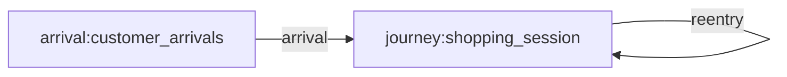
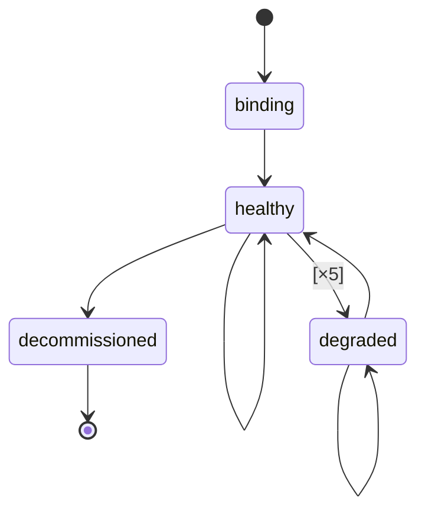
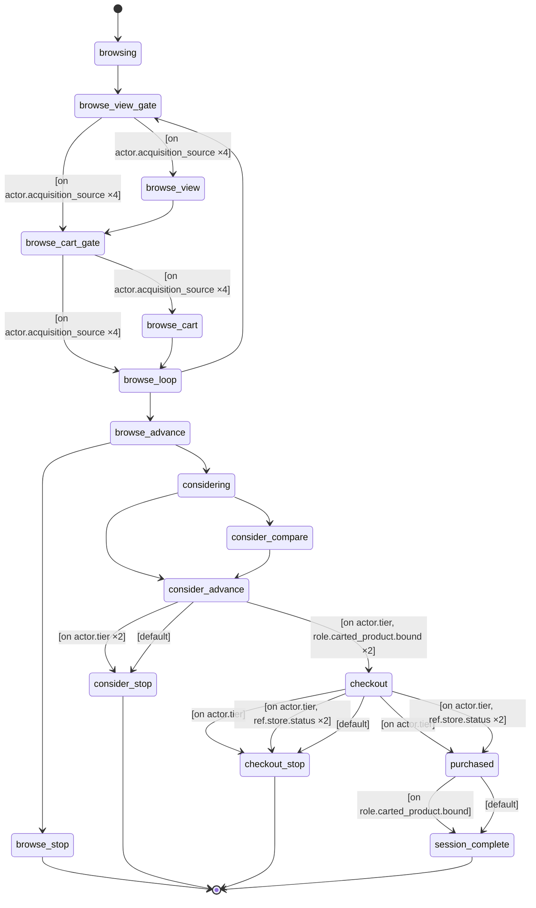

# TechMart Electronics, a three-year online consumer-electronics retailer: customers arrive organically at a secularly growing rate and each run a shopping session that funnels from visit through product views, cart adds and comparisons to checkout and purchase, buying popularity-weighted products from a fixed catalog and returning after a cooling-off period. Behaviour is stratified by acquisition channel (view-first organic browsing vs deep-linked social carting), loyalty tier, price segment and segment-correlated household income, and traffic is shaped by a seasonal calendar of weekend lifts, Black Friday and Cyber Monday spikes, a holiday bell and off-season slumps — with peak events lifting basket size and conversion, not just arrivals, outages suppressing repeat visits alongside new ones, deal days flattening the product mix while back-to-school concentrates it, and an October 2024 loyalty push raising repeat rates for VIP shoppers only — emitted as an event-grain base dataset of customers, products, storefront infrastructure and customer actions.

## Flow

## Types
- **actor.customer** — A TechMart shopper — carries the commercial attributes that steer the funnel (loyalty tier, price segment, household income) alongside recorded-only demographics (acquisition source, age, country) and a lifetime purchase count that grows with each completed order.
- **actor.ops** — The storefront operations monitor — a single automated agent that polls the storefront host on a regular cadence and flips it into a degraded state during incidents, then restores it, writing the health status the customer funnel reacts to.
- **entity.product** — A catalog item TechMart sells — carries its category, price (in cents), a popularity weight that governs how often shoppers view, compare, cart and buy it, and its gross margin in percentage points (recorded for downstream analysis; no mechanism reads it).
- **entity.infrastructure** — A storefront host serving the shop, carrying its health status and error rate; its reliability over time bears on how many sessions complete.

## Resources
_None declared._

## Journeys
- **storefront_ops** — The storefront operations loop: bind the host, then poll its health on a regular cadence, dropping it into a degraded state for the duration of each incident window and restoring it to healthy afterwards.
  - **binding** — The ops bot attaches to the storefront host it will watch.
  - **healthy** — The storefront is serving normally; the bot re-checks its health each poll.
  - **degraded** — The storefront is degraded during an incident; the bot holds this state until the incident window ends, then restores health.
  - **decommissioned** — The storefront host has been retired and is no longer monitored.

- **shopping_session** — A single visit to the store: the shopper browses, may view and cart products, considers and compares them, and either reaches checkout and buys or leaves without purchasing; a completed session may return after a cooling-off period.
  - **browsing** — The shopper has opened a session and landed on the store, beginning to look around.
  - **browse_view_gate** — Deciding whether this visit surfaces a product view — organic and referral shoppers browse product pages first, while social arrivals deep-link past them.
  - **browse_view** — Looking at a specific product's page.
  - **browse_cart_gate** — Deciding whether the shopper adds an item to the cart on this pass — deep-linked social arrivals cart eagerly, view-first browsers are choosier.
  - **browse_cart** — Adding a product to the cart, in some quantity.
  - **browse_loop** — The shopper chooses whether to keep browsing for more items or move on toward considering the cart.
  - **browse_advance** — The browsing shopper either engages further and moves on to consider, or leaves the store.
  - **considering** — Weighing the products of interest, deciding whether to compare any of them.
  - **consider_compare** — Comparing two products side by side.
  - **consider_advance** — The considering shopper either forms intent over the carted items and proceeds to checkout, or leaves without buying; a shopper who carted nothing has nothing to buy and always leaves.
  - **checkout** — The shopper has reached the checkout page and begins to check out.
  - **purchased** — The shopper completes the order, buying the items accumulated in the cart.
  - **browse_stop** — The shopper left during browsing without buying.
  - **consider_stop** — The shopper left while considering, without buying.
  - **checkout_stop** — The shopper abandoned at checkout without buying.
  - **session_complete** — The session has ended after a completed order.

## Influence Rules
_None declared._

## Arrival Streams
- **customer_arrivals** — The stream of new customers arriving organically at TechMart, with exponential inter-arrival times modulated by the seasonal demand calendar; the customer base accumulates from an empty start with no pre-seeded population.
- **product_minting** — A continuous trickle of new, mostly-accessory product SKUs added to the catalog over time, so the assortment grows and its category mix drifts as the run proceeds.

## Events
- **storefront_incident_oct2022** — A storefront degradation of about a week in October 2022 (elevated error rate ~0.30): errors flap in over the first day, hold, then recover with a tail; checkout completion for regular shoppers collapses while degraded.
- **storefront_incident_oct2022_hold** — Holds the October 2022 incident open: recovery is suppressed mid-window and released through the ramp-down.
- **storefront_incident_oct2022_traffic** — Shopper traffic dips while the storefront is degraded in October 2022 — would-be visitors bounce off the erroring site.
- **storefront_incident_mar2023** — A storefront degradation of about nine days in March 2023 (elevated error rate ~0.28): errors flap in over the first day, hold, then recover with a tail; checkout completion for regular shoppers collapses while degraded.
- **storefront_incident_mar2023_hold** — Holds the March 2023 incident open: recovery is suppressed mid-window and released through the ramp-down.
- **storefront_incident_mar2023_traffic** — Shopper traffic dips while the storefront is degraded in March 2023 — would-be visitors bounce off the erroring site.
- **storefront_incident_feb2024** — A storefront degradation of about eight days in February 2024 (elevated error rate ~0.35): errors flap in over the first day, hold, then recover with a tail; checkout completion for regular shoppers collapses while degraded.
- **storefront_incident_feb2024_hold** — Holds the February 2024 incident open: recovery is suppressed mid-window and released through the ramp-down.
- **storefront_incident_feb2024_traffic** — Shopper traffic dips while the storefront is degraded in February 2024 — would-be visitors bounce off the erroring site.
- **storefront_incident_may2024** — A storefront degradation of about twelve days from late May 2024 (elevated error rate ~0.40, the run's worst): errors flap in over the first day and a half, hold, then recover with a tail; checkout completion for regular shoppers collapses while degraded.
- **storefront_incident_may2024_hold** — Holds the May 2024 incident open: recovery is suppressed mid-window and released through the ramp-down.
- **storefront_incident_may2024_traffic** — Shopper traffic dips while the storefront is degraded in May 2024 — would-be visitors bounce off the erroring site.
- **storefront_incident_sep2024** — A storefront degradation of about five days in September 2024 (elevated error rate ~0.25, the mildest and shortest event): errors flap in, hold briefly, then recover with a tail; checkout completion for regular shoppers softens while degraded.
- **storefront_incident_sep2024_hold** — Holds the September 2024 incident open: recovery is suppressed mid-window and released through the ramp-down.
- **storefront_incident_sep2024_traffic** — Shopper traffic dips while the storefront is degraded in September 2024 — would-be visitors bounce off the erroring site.
- **secular_growth** — TechMart's underlying customer acquisition grows steadily across the whole window — a rising baseline the seasonal calendar modulates, so each year's traffic sits above the last.
- **spring_flash_sale_2024** — A week-long spring 2024 flash sale that pushes browsing shoppers of every channel to add items to the cart at a ~90% rate.
- **weekend_surge** — Higher shopper traffic on Saturdays and Sundays.
- **black_friday_2022** — The Black Friday shopping peak in 2022, the year's single busiest arrival day.
- **black_friday_2023** — The Black Friday shopping peak in 2023.
- **black_friday_2024** — The Black Friday shopping peak in 2024.
- **black_friday_conversion_2022** — Black Friday 2022 deals lift buying intent and checkout completion during the peak, not just traffic.
- **black_friday_conversion_2023** — Black Friday 2023 deals lift buying intent and checkout completion during the peak, not just traffic.
- **black_friday_conversion_2024** — Black Friday 2024 deals lift buying intent and checkout completion during the peak, not just traffic.
- **cyber_monday_2022** — The Cyber Monday online-shopping surge in 2022, the Monday after Thanksgiving.
- **cyber_monday_2023** — The Cyber Monday online-shopping surge in 2023.
- **cyber_monday_2024** — The Cyber Monday online-shopping surge in 2024.
- **holiday_season** — The end-of-year holiday shopping season, a sustained lift in traffic through December.
- **holiday_season_behavior** — Holiday shoppers behave differently, not just arrive more often: through the holiday window sessions gather more items per cart and convert to purchase at higher rates.
- **vip_october_2024_retention** — An October 2024 loyalty push aimed only at VIP shoppers, who return for another session far more often through that month than they do the rest of the year, while regular shoppers return at their usual rate.
- **post_holiday_slump** — The quiet stretch of reduced shopping in early January after the holidays.
- **summer_slowdown** — The mid-summer lull when shopping traffic softens.
- **back_to_school** — The late-summer back-to-school ramp in shopping traffic, during which demand also concentrates onto the season's most popular products.
