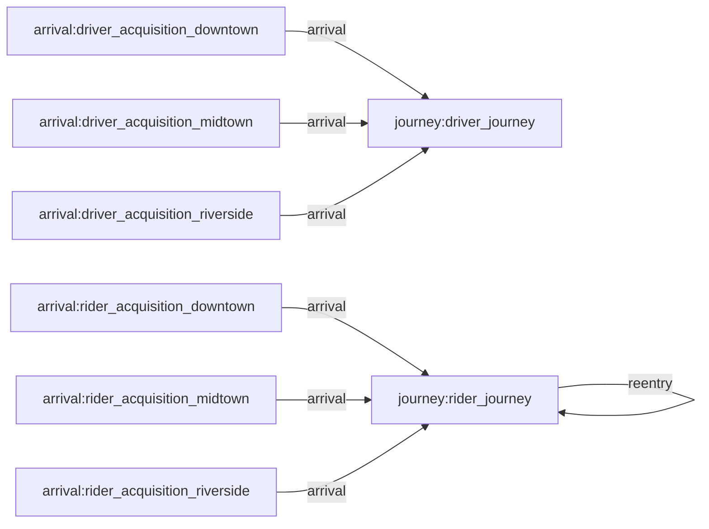
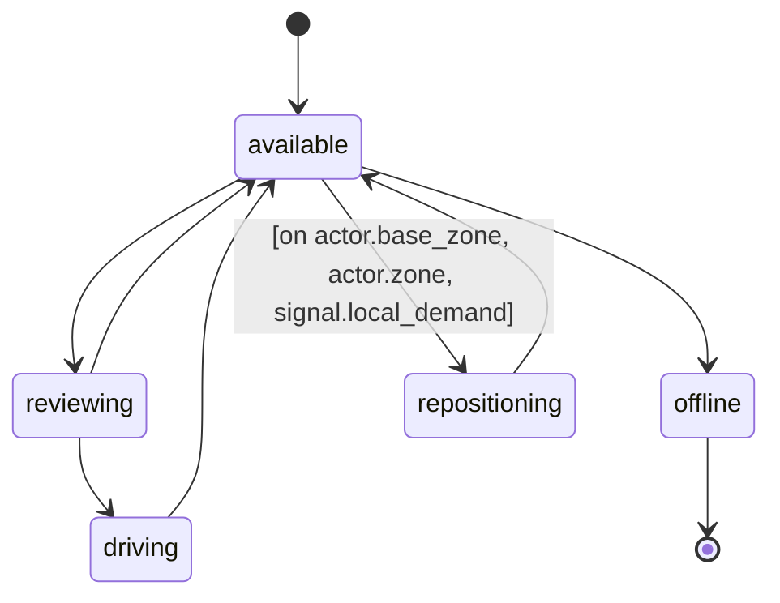
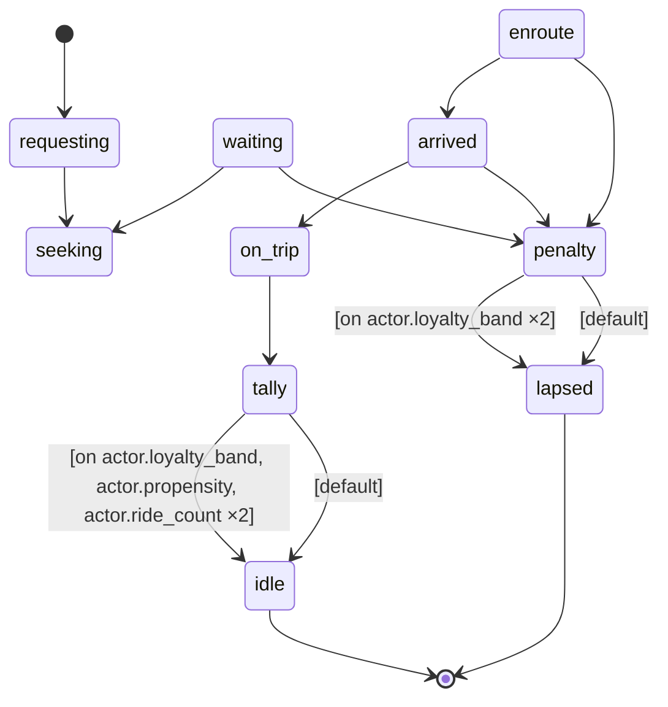

# A two-sided ride-hailing marketplace across three city zones: riders (demand) and drivers (supply) are both agents on one clock, tied by an actor-to-actor match and coupled by a surge price signal — wait, match success, spatial supply deserts, surge episodes, and loyalty-driven churn all emerge from the moment-to-moment supply/demand balance rather than being written into the data.

## Flow

## Types
- **actor.rider** — A demand-side agent hailing rides — carries an intrinsic propensity class and origin/destination zones (which steer how fast loyalty is earned and where trips drain supply), plus earned ride_count and loyalty_band that track its lifetime with the market.
- **actor.driver** — A supply-side agent serving trips — carries an intrinsic strategy class and home base zone, plus a mutable current zone that trips and deadheads relocate and a session_rides tally credited as it completes rides.
- **entity.zone_market** — A city zone as a first-class record — the spatial grain of the market. Its selection weights steer where riders originate, where trips end, and where drivers are based, and it carries the emitted per-zone demand and supply pressure streams a consumer joins into local surge.

## Resources
_None declared._

## Journeys
- **driver_journey** — The supply-side lifecycle of a driver — logging on available, being matched and reviewing a dispatch, driving a trip, repositioning home when drained away, and logging off after a quiet stretch.
  - **available** — Online and idle at the rank, counting as supply and waiting to be matched to a rider; may log off or reposition if no trip comes.
  - **repositioning** — An idle driver drained away from home deadheading back empty toward its base zone to rejoin the available pool there, diffusing supply back.
  - **reviewing** — Provisionally holding a just-matched dispatch while the driver decides whether to accept the trip or decline and free the rider back to search.
  - **driving** — Committed to and carrying out the matched trip, off the supply count until the rider's trip-completion resumes it as available at the destination.
  - **offline** — Logged off and left the market; replacement supply arrives as fresh drivers via the log-on stream, so the fleet breathes rather than being a fixed roster.

- **rider_journey** — The demand-side lifecycle of a rider — requesting a trip, seeking and waiting for a match, riding to the destination, then earning or eroding loyalty and either re-riding or lapsing out of the market.
  - **requesting** — The trip has begun; the rider is opening its request in its origin zone before the market attempts a match.
  - **seeking** — Actively scanning for a free driver in its origin zone to claim; this is the pending-demand state the surge signal counts.
  - **waiting** — Found no free driver and holding on — re-polling in hope of a match while a give-up impulse builds toward abandoning the request.
  - **enroute** — Matched, with the accepted driver on its way to the pickup — unless the driver declines mid-review, in which case the rider resumes here as declined.
  - **arrived** — The driver has reached the pickup point; the rider either boards for the ride or fails to show.
  - **on_trip** — Riding to the destination; on completion the ride is credited to both sides' tallies and the driver is relocated to the destination zone.
  - **tally** — The post-trip loyalty check where a rider's earned band may climb a tier once its completed-ride count crosses the propensity-gated threshold.
  - **idle** — Resting between trips after a good outcome; a satisfied rider that re-entry may recycle into a fresh trip.
  - **penalty** — The post-bad-outcome loyalty check after a renege, no-show, or decline, dropping the rider's earned band one tier before it lapses.
  - **lapsed** — Left the market after a bad experience; re-entry is still possible but the eroded band makes returning less likely, so bad service drives churn.

## Influence Rules
_None declared._

## Arrival Streams
- **rider_acquisition_downtown** — The stream of riders joining the market in Downtown to hail trips, with diurnal morning and evening demand peaks and an overnight lull, dampened when Downtown's own surge is high.
- **rider_acquisition_midtown** — The stream of riders joining the market in Midtown to hail trips — same diurnal shape as Downtown's, dampened when Midtown's own surge is high.
- **rider_acquisition_riverside** — The stream of riders joining the market in Riverside to hail trips — same diurnal shape as Downtown's, dampened when Riverside's own surge is high.
- **driver_acquisition_downtown** — The stream of drivers logging on based in Downtown — deliberately flatter than demand, so the sharp demand peaks outrun supply and open the gap surge feeds on, with Downtown's own surge pulling extra log-ons toward its peaks.
- **driver_acquisition_midtown** — The stream of drivers logging on based in Midtown — same flat supply shape, with Midtown's own surge pulling extra log-ons toward its peaks.
- **driver_acquisition_riverside** — The stream of drivers logging on based in Riverside — same flat supply shape, with Riverside's own surge pulling extra log-ons toward its peaks.

## Events
- **weekend_evening_demand** — Weekend nightlife pressure — Friday and Saturday evenings run hotter, stacking extra demand on top of the ordinary evening peak.
- **concert_letout_shock** — A one-off venue let-out shock — a crowd leaving an event on the opening Friday night creates a sharp demand spike that ramps up and decays.
- **surge_suppresses_riders** — The demand-side surge response, localized — in each zone where pending riders outnumber the drivers currently there, that zone's rising price dampens its marginal new signups, standing in for price-sensitive riders who defer.
- **surge_attracts_drivers** — The supply-side surge response, localized — each zone's demand/supply imbalance pulls more drivers to log on based in that zone, standing in for surge-chasers migrating toward the higher local price.
- **emit_zone_demand_pressure** — Publishes a first-class, history-tracked demand-pressure signal per zone — the zone's pending-rider count passed through a transfer curve (empty zone -> neutral 1.0), so local surge becomes a joinable per-zone record rather than a hidden internal factor.
- **emit_zone_supply_pressure** — Publishes a first-class, history-tracked supply-pressure signal per zone — the zone's available-driver count passed through the same transfer curve (empty zone -> neutral 1.0) — the denominator a consumer joins against demand pressure to recover per-zone surge.
