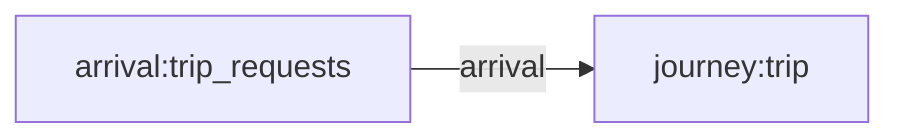
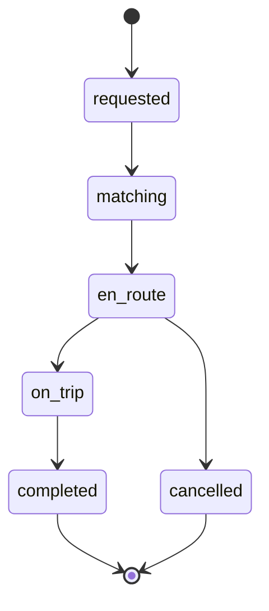

# A single-region ride-sharing marketplace over one week: riders request trips through the day, a small finite driver fleet picks them up and frees up for the next request, and each trip walks a lifecycle from request to a completed or cancelled outcome — rendered as a per-trip change-data-capture changelog in which rider match-wait emerges from a peaking demand stream contending for a fixed fleet.

## Flow

## Types
- **actor.trip** — A single ride request and its lifecycle — the transactional fact whose history-tracked status becomes the CDC changelog, carrying an assigned rider, pickup zone and, once matched, a held driver.
- **entity.rider** — A rider dimension row — a lookup-join target carrying a name and loyalty tier, assigned to each trip at request time.
- **entity.zone** — A pickup-zone dimension row — a lookup-join target carrying a name and zone type (commercial, transit, residential, campus) for each trip's origin.
- **resource.driver** — A driver in the finite metro fleet — a seizable resource a trip holds from match through drop-off; all drivers share one queue, so riders wait when every driver is busy.

## Resources
- **resource.driver** _(pool)_ — A driver in the finite metro fleet — a seizable resource a trip holds from match through drop-off; all drivers share one queue, so riders wait when every driver is busy.
  - partition: region — metro
  - seized by: trip.matching (tick)

## Journeys
- **trip** — The trip lifecycle from request through matching, pickup and the ride to a completed or cancelled outcome — the state machine whose status changes drive the SCD-2 / CDC changelog.
  - **requested** — A newly arrived trip binding its rider and pickup zone, then searching for an available driver.
  - **matching** — The trip waiting to seize a driver from the shared fleet, holding in the queue when every driver is busy — this wait is the emergent match-time.
  - **en_route** — A driver has been matched and is driving to the rider, who then either boards or turns out to be a no-show.
  - **on_trip** — The rider has boarded and the ride is underway toward drop-off.
  - **completed** — The ride finished and the driver was released — the terminal success outcome.
  - **cancelled** — The rider was a no-show, releasing the driver without a ride — the terminal cancellation outcome.

## Influence Rules
_None declared._

## Arrival Streams
- **trip_requests** — The stream of rider trip requests arriving through the day, with inter-arrival times shaped by hour-of-day so demand peaks at the morning and evening rush and falls away overnight.

## Events
_None declared._
