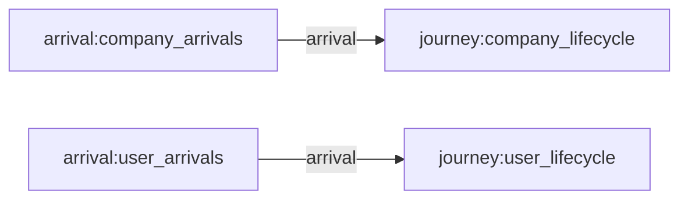
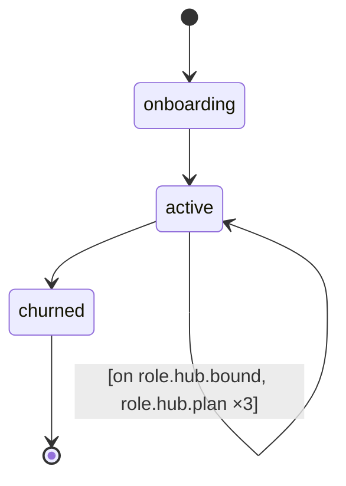
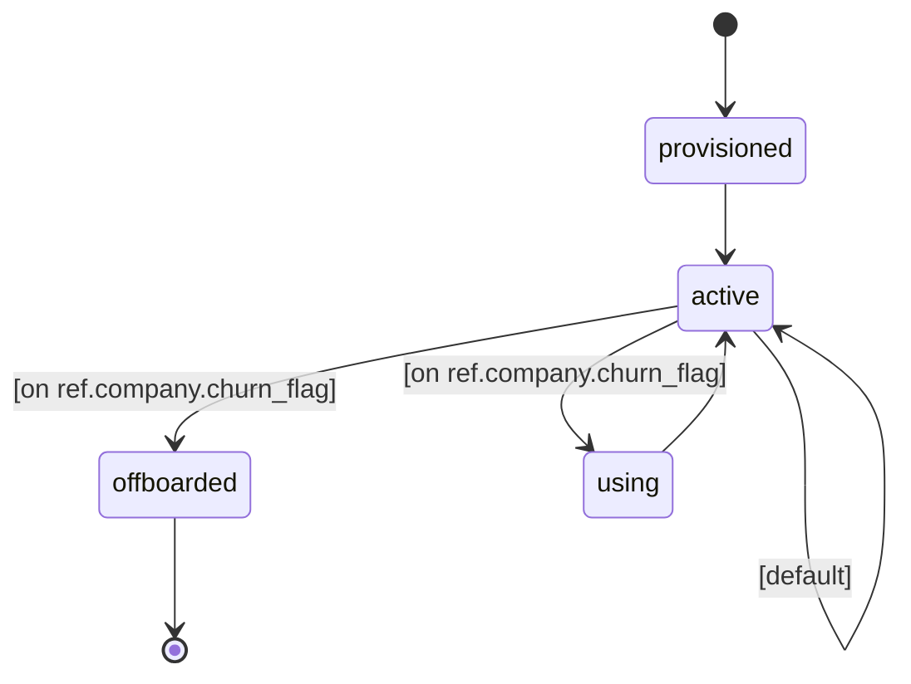

# A B2B SaaS vendor over five years: companies sign up on a plan tier and provision a hub of seats, their users cycle weekly between using the product and sitting idle, and a repeating renewal review either renegotiates the account's pricing or ends it — so the seat-price trail, the negotiated usage discounts, and the offboarding cascade onto users all emerge from each account's own review history rather than being written into the data.

## Flow

## Types
- **actor.company** — A subscribing organisation — the account holder whose lifecycle runs from onboarding through repeated renewal reviews to churn; its commercial terms live on the company_hub it provisions rather than on the actor itself.
- **actor.user** — A seat holder — an individual working inside a subscribing company, attached to that account's hub and cycling between product use and idle weeks until the account churns and the seat is released.
- **entity.company_hub** — The commercial record of an account — its plan tier and the pull it exerts on new seats, alongside the history-tracked pricing trail (seat price, and the negotiated percent of list rate paid for usage — 100 until an enterprise review negotiates it down), the churn marker that cascades to its users, and the engagement score the daily roll-up writes.
- **entity.sku** — A product line in the catalogue — the feature a usage session is attributed to, carrying how often it is reached for and its list rate per unit of usage volume.

## Resources
_None declared._

## Journeys
- **company_lifecycle** — The account lifecycle — a company onboards onto a freshly provisioned hub, then enters a repeating renewal review that each quarter either renegotiates its commercial terms or ends the subscription, marking the hub so its seats offboard in turn.
  - **onboarding** — The account is being set up; its hub is provisioned here with a plan tier and opening commercial terms, before the subscription goes live.
  - **active** — The live subscription, revisited at every renewal review — each review either renegotiates the account's pricing and returns it here, or ends the subscription.
  - **churned** — The subscription has ended; the hub is flagged churned so it stops drawing new seats and its existing users begin offboarding.

- **user_lifecycle** — The seat lifecycle — a user is provisioned against its company's hub, then cycles week by week between using the product and letting the cycle pass, until the account churns and the seat is given up.
  - **provisioned** — The seat has been created but is not yet in service, waiting on the account to finish setting the user up.
  - **active** — Holding a live seat between sessions — each cycle the user either opens a usage session, lets the week pass unused, or starts offboarding once its account has churned.
  - **using** — Inside a usage session — the product line being used is picked here and the session's volume recorded against it, before the user returns to its idle seat.
  - **offboarded** — The seat has been given up after the account churned; the user has left the product.

## Influence Rules
_None declared._

## Arrival Streams
- **company_arrivals** — The stream of companies signing up for the product, lifted each year by the autumn buying season.
- **user_arrivals** — The stream of users being given seats, each landing on an existing account in proportion to how strongly that account pulls new seats — so large accounts keep growing and churned ones stop attracting anyone.

## Events
- **invite_only_launch** — The private-beta window at launch — seat provisioning is held back until the product opens to general availability, so the earliest accounts sit near-empty before their users arrive.
- **spring_push** — The annual spring usage campaign — a fortnight each March that pushes existing seat holders into sessions they would otherwise have skipped, without drawing in any new accounts.
- **fall_buying_season** — The annual autumn buying season — a month each September when budget cycles open and companies sign up well above the baseline rate, with no effect on how existing seats are used.
- **engagement_refresh** — The daily account-health roll-up — each account's count of actively-seated users is folded into a saturating engagement score published on its hub, so customer-success reads a health signal that tracks real usage instead of a stored label.
