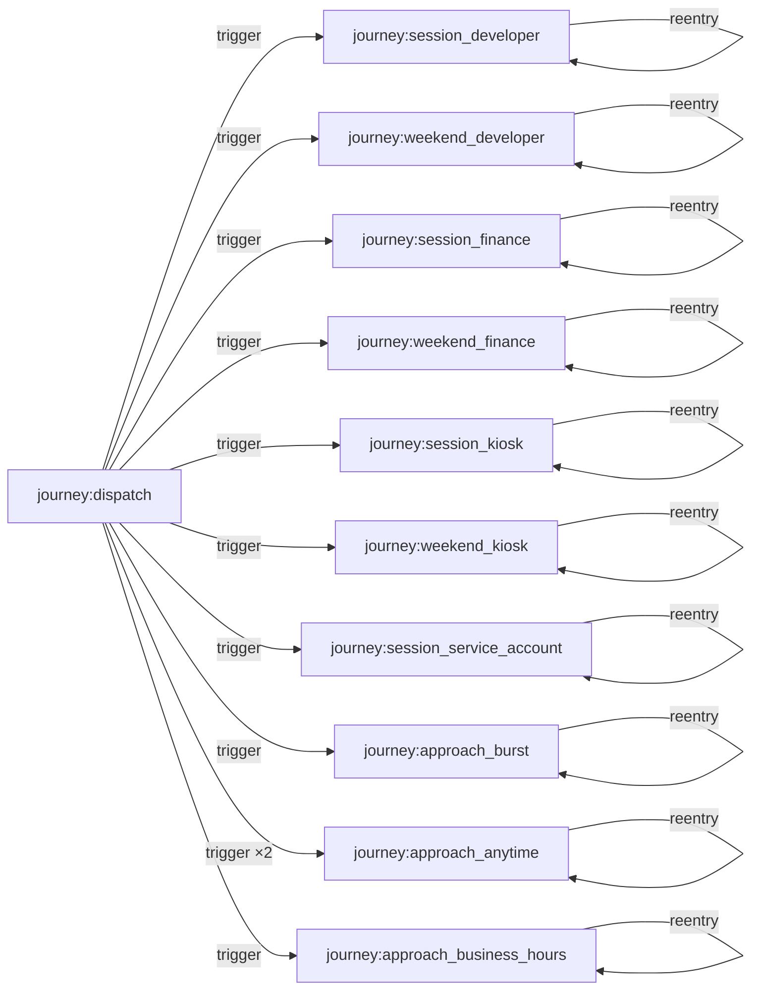
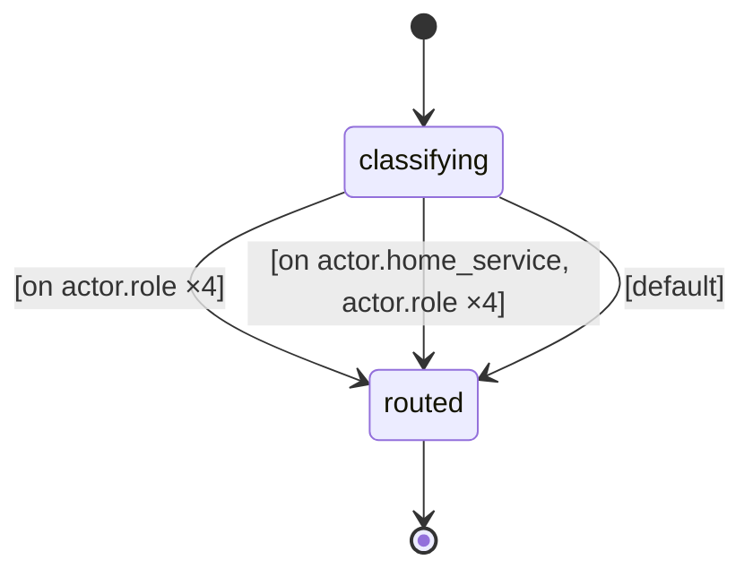
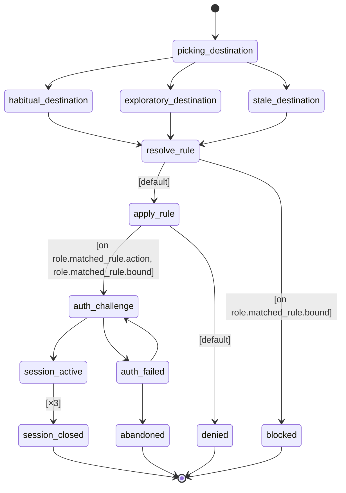
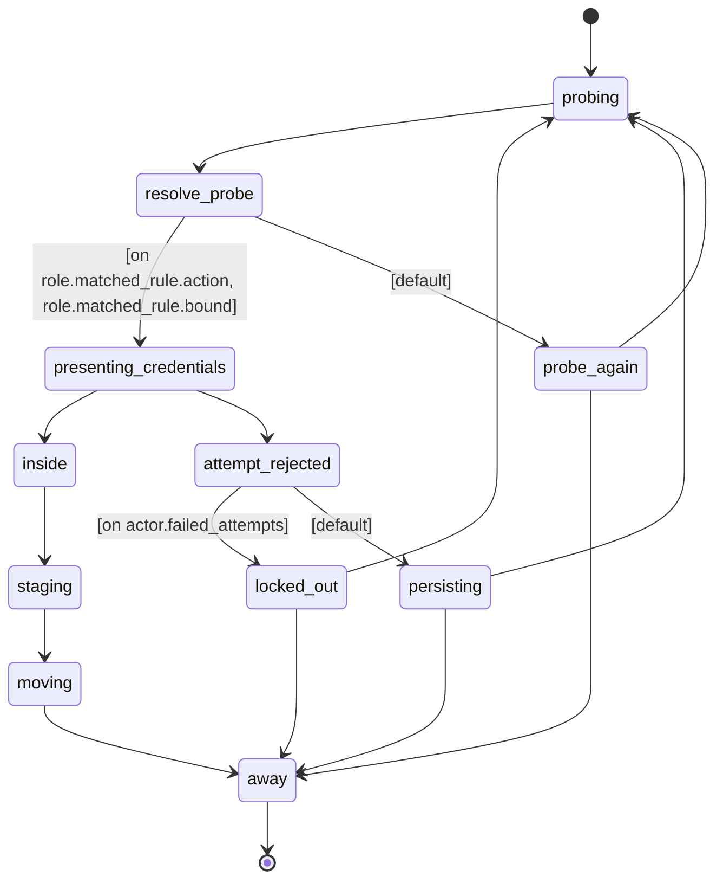

# A 90-day SIEM log corpus of correlated firewall and authentication records over a segmented network: 117 internal hosts across thirty subnets run role-specific benign session journeys (each role with its own cadence, hours, and retry appetite) against a 42-server service estate behind an authored firewall ruleset, while — after a 30-day clean baseline — four external hosts walk an approach FSM toward intrusion and two ABM rules spread destination range through shared segments and subnets, so the attack signal is a shift in per-host reach and denies rather than any labeled event.

## Flow

## Types
- **actor.host** — A machine that originates connections — the 117 internal workstations, kiosks, and service boxes plus the four external approach hosts — carrying the zone, subnet, role, habitual service, breadth, and auth reliability that shape every firewall and authentication record it generates.
- **entity.server** — A destination in the service estate — hostname, zone, listening port, and the service it backs; the fixed inventory whose width caps a host's distinct-destinations-per-day, the headline breadth signal.
- **entity.account** — A credential principal — user or service account — owned by one host; the identity that host's authentication records report on every accept or reject.
- **entity.fw_rule** — One entry in the authored firewall ruleset, matching a source-zone / destination-zone / port route to a disposition; routes no rule covers are the denies the intrusion narrative trips over.

## Resources
_None declared._

## Journeys
- **dispatch** — Routes each host to the session journey for its role.
  - **classifying** — The host's role decides which session cadence it runs on.
  - **routed** — The host has been handed to its role's session journey.

- **session_developer** — Developer workstation session — the busiest human cohort.
  - **picking_destination** — The host decides whether this session is routine or off-pattern.
  - **habitual_destination** — The host reaches its own service — the routine case.
  - **exploratory_destination** — The host reaches something outside its habit — stale bookmark, wrong service, curiosity.
  - **stale_destination** — The host reaches the service it has always reached, on a route it no longer has.
  - **resolve_rule** — The firewall matches the connection against its ruleset.
  - **apply_rule** — The matched rule's disposition decides the connection.
  - **auth_challenge** — The account behind the connection is presented to the service.
  - **auth_failed** — The credentials were rejected on this attempt.
  - **session_active** — The connection is established and carrying traffic.
  - **session_closed** — The session ran to completion and closed normally.
  - **abandoned** — Authentication failed and the host stopped retrying.
  - **denied** — A rule explicitly denied the connection.
  - **blocked** — No rule matched; the default-deny posture applied.

- **session_finance** — Finance workstation session — same body, slower cadence.
  - **picking_destination** — The host decides whether this session is routine or off-pattern.
  - **habitual_destination** — The host reaches its own service — the routine case.
  - **exploratory_destination** — The host reaches something outside its habit — stale bookmark, wrong service, curiosity.
  - **stale_destination** — The host reaches the service it has always reached, on a route it no longer has.
  - **resolve_rule** — The firewall matches the connection against its ruleset.
  - **apply_rule** — The matched rule's disposition decides the connection.
  - **auth_challenge** — The account behind the connection is presented to the service.
  - **auth_failed** — The credentials were rejected on this attempt.
  - **session_active** — The connection is established and carrying traffic.
  - **session_closed** — The session ran to completion and closed normally.
  - **abandoned** — Authentication failed and the host stopped retrying.
  - **denied** — A rule explicitly denied the connection.
  - **blocked** — No rule matched; the default-deny posture applied.

- **session_kiosk** — Shared kiosk session — the quietest cohort, same working hours.
  - **picking_destination** — The host decides whether this session is routine or off-pattern.
  - **habitual_destination** — The host reaches its own service — the routine case.
  - **exploratory_destination** — The host reaches something outside its habit — stale bookmark, wrong service, curiosity.
  - **stale_destination** — The host reaches the service it has always reached, on a route it no longer has.
  - **resolve_rule** — The firewall matches the connection against its ruleset.
  - **apply_rule** — The matched rule's disposition decides the connection.
  - **auth_challenge** — The account behind the connection is presented to the service.
  - **auth_failed** — The credentials were rejected on this attempt.
  - **session_active** — The connection is established and carrying traffic.
  - **session_closed** — The session ran to completion and closed normally.
  - **abandoned** — Authentication failed and the host stopped retrying.
  - **denied** — A rule explicitly denied the connection.
  - **blocked** — No rule matched; the default-deny posture applied.

- **weekend_developer** — Developer working at the weekend — same session, sparser regime.
  - **picking_destination** — The host decides whether this session is routine or off-pattern.
  - **habitual_destination** — The host reaches its own service — the routine case.
  - **exploratory_destination** — The host reaches something outside its habit — stale bookmark, wrong service, curiosity.
  - **stale_destination** — The host reaches the service it has always reached, on a route it no longer has.
  - **resolve_rule** — The firewall matches the connection against its ruleset.
  - **apply_rule** — The matched rule's disposition decides the connection.
  - **auth_challenge** — The account behind the connection is presented to the service.
  - **auth_failed** — The credentials were rejected on this attempt.
  - **session_active** — The connection is established and carrying traffic.
  - **session_closed** — The session ran to completion and closed normally.
  - **abandoned** — Authentication failed and the host stopped retrying.
  - **denied** — A rule explicitly denied the connection.
  - **blocked** — No rule matched; the default-deny posture applied.

- **weekend_finance** — Finance working at the weekend — same session, sparser regime.
  - **picking_destination** — The host decides whether this session is routine or off-pattern.
  - **habitual_destination** — The host reaches its own service — the routine case.
  - **exploratory_destination** — The host reaches something outside its habit — stale bookmark, wrong service, curiosity.
  - **stale_destination** — The host reaches the service it has always reached, on a route it no longer has.
  - **resolve_rule** — The firewall matches the connection against its ruleset.
  - **apply_rule** — The matched rule's disposition decides the connection.
  - **auth_challenge** — The account behind the connection is presented to the service.
  - **auth_failed** — The credentials were rejected on this attempt.
  - **session_active** — The connection is established and carrying traffic.
  - **session_closed** — The session ran to completion and closed normally.
  - **abandoned** — Authentication failed and the host stopped retrying.
  - **denied** — A rule explicitly denied the connection.
  - **blocked** — No rule matched; the default-deny posture applied.

- **weekend_kiosk** — Kiosk used at the weekend — same session, sparser regime.
  - **picking_destination** — The host decides whether this session is routine or off-pattern.
  - **habitual_destination** — The host reaches its own service — the routine case.
  - **exploratory_destination** — The host reaches something outside its habit — stale bookmark, wrong service, curiosity.
  - **stale_destination** — The host reaches the service it has always reached, on a route it no longer has.
  - **resolve_rule** — The firewall matches the connection against its ruleset.
  - **apply_rule** — The matched rule's disposition decides the connection.
  - **auth_challenge** — The account behind the connection is presented to the service.
  - **auth_failed** — The credentials were rejected on this attempt.
  - **session_active** — The connection is established and carrying traffic.
  - **session_closed** — The session ran to completion and closed normally.
  - **abandoned** — Authentication failed and the host stopped retrying.
  - **denied** — A rule explicitly denied the connection.
  - **blocked** — No rule matched; the default-deny posture applied.

- **session_service_account** — Batch service account — machine cadence, no working hours.
  - **picking_destination** — The host decides whether this session is routine or off-pattern.
  - **habitual_destination** — The host reaches its own service — the routine case.
  - **exploratory_destination** — The host reaches something outside its habit — stale bookmark, wrong service, curiosity.
  - **stale_destination** — The host reaches the service it has always reached, on a route it no longer has.
  - **resolve_rule** — The firewall matches the connection against its ruleset.
  - **apply_rule** — The matched rule's disposition decides the connection.
  - **auth_challenge** — The account behind the connection is presented to the service.
  - **auth_failed** — The credentials were rejected on this attempt.
  - **session_active** — The connection is established and carrying traffic.
  - **session_closed** — The session ran to completion and closed normally.
  - **abandoned** — Authentication failed and the host stopped retrying.
  - **denied** — A rule explicitly denied the connection.
  - **blocked** — No rule matched; the default-deny posture applied.

- **approach_anytime** — An external host working through the perimeter, on no calendar.
  - **probing** — The host picks a destination and tries it.
  - **resolve_probe** — The perimeter evaluates the connection, exactly as it does for anyone.
  - **probe_again** — That route was shut; the host decides whether to keep looking.
  - **presenting_credentials** — The host offers credentials for an account it does not own.
  - **attempt_rejected** — The credentials were refused; the counter advances.
  - **persisting** — The host decides whether to try again or come back another time.
  - **locked_out** — The account stopped accepting attempts.
  - **inside** — The credentials were accepted.
  - **staging** — An ordinary session, on an unusual destination for this host.
  - **moving** — A second session, larger, outbound.
  - **away** — The host is not doing anything observable.

- **approach_burst** — The same approach, worked through in one sitting rather than over weeks.
  - **probing** — The host picks a destination and tries it.
  - **resolve_probe** — The perimeter evaluates the connection, exactly as it does for anyone.
  - **probe_again** — That route was shut; the host decides whether to keep looking.
  - **presenting_credentials** — The host offers credentials for an account it does not own.
  - **attempt_rejected** — The credentials were refused; the counter advances.
  - **persisting** — The host decides whether to try again or come back another time.
  - **locked_out** — The account stopped accepting attempts.
  - **inside** — The credentials were accepted.
  - **staging** — An ordinary session, on an unusual destination for this host.
  - **moving** — A second session, larger, outbound.
  - **away** — The host is not doing anything observable.

- **approach_business_hours** — The same approach, confined to working hours — it arrives inside the crowd.
  - **probing** — The host picks a destination and tries it.
  - **resolve_probe** — The perimeter evaluates the connection, exactly as it does for anyone.
  - **probe_again** — That route was shut; the host decides whether to keep looking.
  - **presenting_credentials** — The host offers credentials for an account it does not own.
  - **attempt_rejected** — The credentials were refused; the counter advances.
  - **persisting** — The host decides whether to try again or come back another time.
  - **locked_out** — The account stopped accepting attempts.
  - **inside** — The credentials were accepted.
  - **staging** — An ordinary session, on an unusual destination for this host.
  - **moving** — A second session, larger, outbound.
  - **away** — The host is not doing anything observable.

```mermaid
stateDiagram-v2
    [*] --> n20b10772
    n20b10772 --> nc31e6866
    nc31e6866 --> nf1491471 : [on role.matched_rule.action, role.matched_rule.bound]
    nc31e6866 --> n7a14bc96 : [default]
    n7a14bc96 --> n20b10772
    n7a14bc96 --> n378ce56a
    nf1491471 --> n106b0862
    nf1491471 --> n61a3adf3
    n61a3adf3 --> nccaba3bb : [on actor.failed_attempts]
    n61a3adf3 --> n2796873b : [default]
    n2796873b --> n20b10772
    n2796873b --> n378ce56a
    nccaba3bb --> n20b10772
    nccaba3bb --> n378ce56a
    n106b0862 --> ne919a753
    ne919a753 --> n6e862940
    n6e862940 --> n378ce56a
    n378ce56a --> [*]
    state "probing" as n20b10772
    state "resolve_probe" as nc31e6866
    state "presenting_credentials" as nf1491471
    state "probe_again" as n7a14bc96
    state "away" as n378ce56a
    state "inside" as n106b0862
    state "attempt_rejected" as n61a3adf3
    state "locked_out" as nccaba3bb
    state "persisting" as n2796873b
    state "staging" as ne919a753
    state "moving" as n6e862940
```

## Influence Rules
- **segment_reach** — A host working a segment is drawn wider by the hosts already ranging widely there.
- **subnet_spread** — A host widens its range in step with the hosts sharing its subnet.

## Arrival Streams
_None declared._

## Events
- **credential_service_wobble** — A directory service has a bad day and rejects credentials it should accept.
- **mail_maintenance** — The mail tier is taken down for patching; hosts keep reaching for it and are refused.
