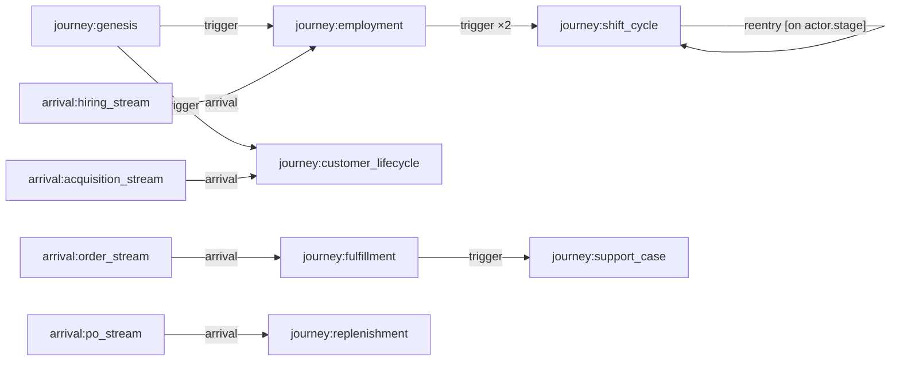
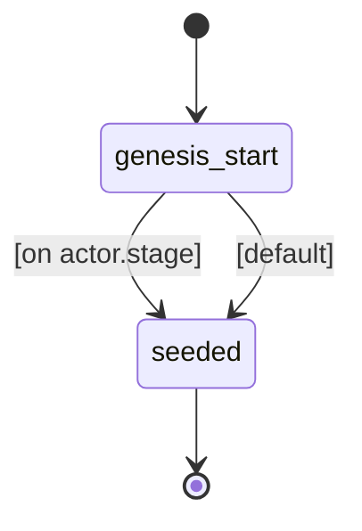
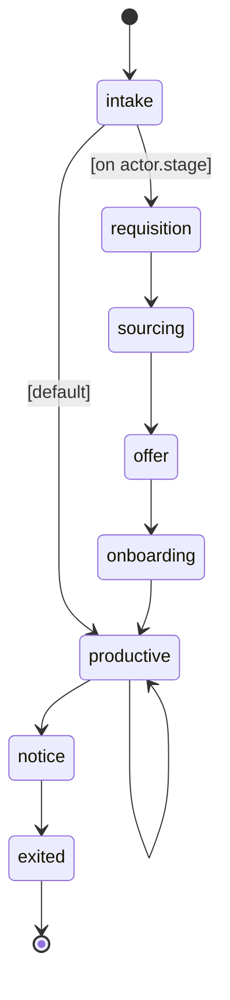
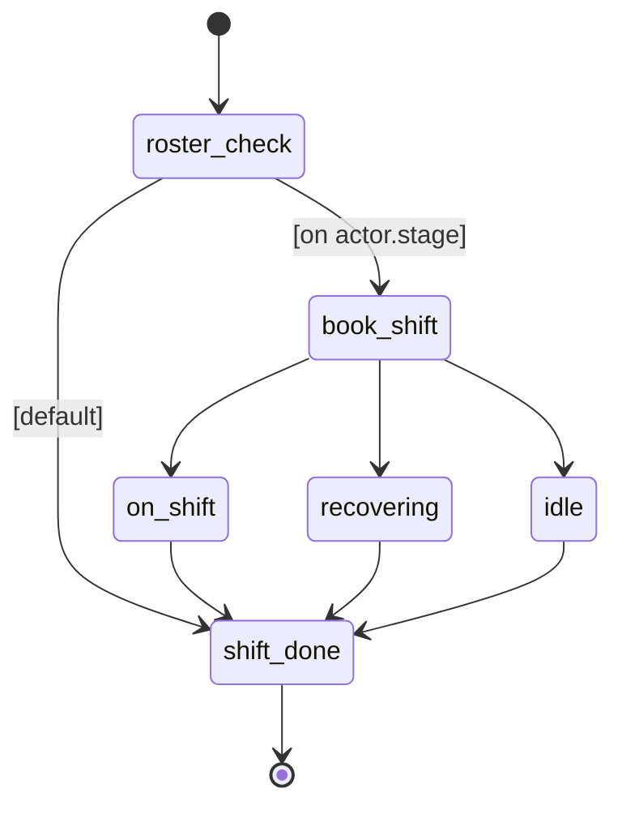
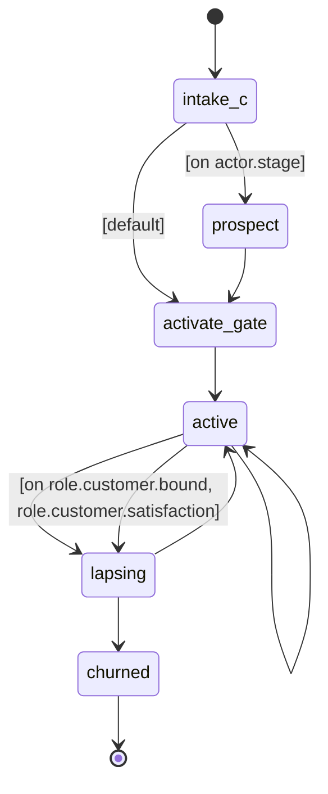
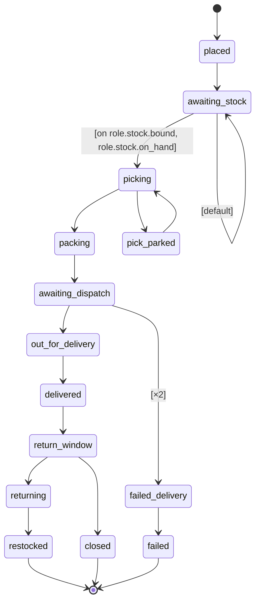
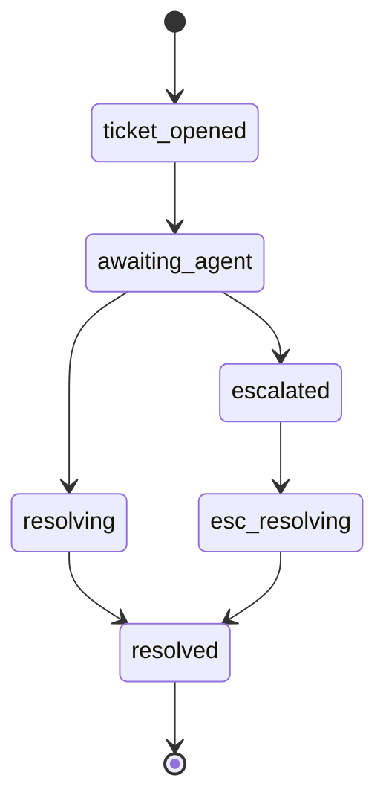
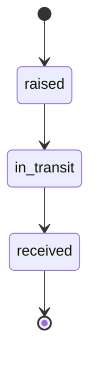

# A regional retailer with its own warehouse and delivery fleet: employment, rostering, customer acquisition, orders, fulfillment, support, returns, and replenishment on one shared cast, with workforce, service, and reorder loops closed by mechanism.

## Flow

## Types
- **actor.employment** — One employee's career at the company, from requisition through exit; carries the skill/facility identity that routes their shifts and the burnout state that drives attrition.
- **actor.customer_lifecycle** — One customer's tenure: prospect -> active -> lapsing -> churned, with win-back; owns the customer entity's lifecycle.
- **actor.order** — One customer order from placement to rest; after a failed delivery the same actor also walks the support_case journey.
- **actor.purchase_order** — One supplier order: raised -> in_transit -> received; receipt restocks the targeted stock line.
- **entity.customer** — A live customer account: order-placement candidate (weighted by propensity) and carrier of the support-written satisfaction signal.
- **entity.stock** — One catalog line: category, demand popularity, and the on-hand count that dispatch depletes and receipts replenish.
- **resource.crew_pool** — A facility crew's working capacity (pickers north/south, drivers north/south); each attended shift raises it for the shift's duration.
- **resource.agent_pool** — The central support desk's working capacity; support-skill attendance raises it. Priority discipline lets escalated cases jump the queue.
- **diary.shift_diary** — A facility's roster calendar; booking a slot schedules a shift, and the no-show draw at the opening is the sick day.
- **diary.delivery_slot** — A facility's delivery-window calendar; the no-show draw at the opening is customer-not-home, the delivery-failure mechanism.

## Resources
- **resource.crew_pool** _(pool)_ — A facility crew's working capacity (pickers north/south, drivers north/south); each attended shift raises it for the shift's duration.
  - seized by: fulfillment.out_for_delivery (tick), fulfillment.picking (tick)
- **resource.agent_pool** _(pool)_ — The central support desk's working capacity; support-skill attendance raises it. Priority discipline lets escalated cases jump the queue.
  - seized by: support_case.awaiting_agent (tick), support_case.escalated (tick)
- **diary.shift_diary** _(diary)_ — A facility's roster calendar; booking a slot schedules a shift, and the no-show draw at the opening is the sick day.
  - booked by: shift_cycle.book_shift (tick)
- **diary.delivery_slot** _(diary)_ — A facility's delivery-window calendar; the no-show draw at the opening is customer-not-home, the delivery-failure mechanism.
  - booked by: fulfillment.awaiting_dispatch (tick)

## Journeys
- **genesis** — Kickoff router for the generated starting population: veterans go to the employment journey, established customers to the lifecycle journey.
  - **genesis_start** — Routing point for the generated starting population, before each veteran joins its real journey.
  - **seeded** — Kickoff complete; the actor now lives in its routed journey.

- **employment** — One career: the hiring pipeline (whose onboarding delay is the workforce loop's inertia), the burnout-weighted attrition roll, and the notice period the hiring aggregate counts.
  - **intake** — Entry gate for a career: new requisitions head into the hiring pipeline, veterans step straight onto the floor.
  - **requisition** — An approved opening awaiting a sourcing effort.
  - **sourcing** — The role is being searched: postings, screens, interviews.
  - **offer** — An offer is out and awaiting acceptance.
  - **onboarding** — Hired but not yet useful: training, equipment, ramp-up.
  - **productive** — A working member of the crew, rostered onto shifts.
  - **notice** — Resignation handed in; still rostered through the notice period.
  - **exited** — The career at this company has ended.

- **shift_cycle** — The roster loop, one journey instance per shift: book a facility slot, roll the sick-day draw at the opening, and move the matching crew pool's capacity +1/-1 around each attended shift. Re-entry (gated on still being employed) books the next shift.
  - **roster_check** — Between shifts: bind the crew pool and check whether this person is still on the roster.
  - **book_shift** — Holding a booked slot on the facility roster until the shift starts.
  - **on_shift** — Working a shift; the crew pool holds this person's capacity.
  - **recovering** — Off sick after a no-show; recovering before rejoining the roster.
  - **idle** — No bookable shift was available; waiting before trying again.
  - **shift_done** — The shift cycle has closed; re-entry books the next one while employment lasts.

- **customer_lifecycle** — One tenure: activation mints the customer entity; the active poll mixes natural (loyalty-weighted) lapse with the scarred-lapse gate on support-written satisfaction; churn tombstones the entity.
  - **intake_c** — Entry gate for a tenure: new prospects enter the funnel, established customers go straight to activation.
  - **prospect** — Evaluating the retailer before a first purchase.
  - **activate_gate** — The account opens: the customer record is minted here.
  - **active** — A live, buying customer.
  - **lapsing** — Engagement has faded; the account is drifting toward churn.
  - **churned** — The tenure has ended and the account is closed.

- **fulfillment** — One order's flow: stock gate and depletion, picker contention, the delivery-window booking whose no-show draw is customer-not-home, the return window, and the failure edge that opens a support case on this same actor.
  - **placed** — The order exists and its product line is chosen.
  - **awaiting_stock** — Waiting for the chosen line to have units on hand.
  - **picking** — Holding (or queuing for) a picker while the order is picked.
  - **pick_parked** — Picking paused: the facility's picker pool is offline.
  - **packing** — Picked goods being packed for dispatch.
  - **awaiting_dispatch** — Packed and holding a booked delivery window.
  - **out_for_delivery** — On a van with a driver, en route to the customer.
  - **delivered** — Handed over to the customer.
  - **return_window** — Delivered and inside the return window.
  - **returning** — A return is on its way back to the warehouse.
  - **restocked** — The returned unit is back on the shelf; the order is closed.
  - **closed** — The order completed without a return.
  - **failed_delivery** — The delivery failed; a support ticket is being opened.
  - **failed** — The order ended in a failed delivery; support owns the aftermath.

- **support_case** — The failed-delivery ticket on the same order actor: agent contention, queue-patience expiry escalating a case to senior handling that jumps the queue, and the distress-clearing resolution the satisfaction aggregate reads.
  - **ticket_opened** — A failed-delivery ticket exists and awaits triage.
  - **awaiting_agent** — Queued for (or being assigned) a support agent; a case whose queue wait outlives its patience escalates instead.
  - **resolving** — An agent is working the case.
  - **escalated** — Escalated for senior handling, jumping the agent queue.
  - **esc_resolving** — A senior agent is working the escalated case.
  - **resolved** — The case is closed; the order actor retires.

- **replenishment** — One supplier order: target a popular stock line, wait out the supplier lead time, and restock on receipt.
  - **raised** — The purchase order exists and its restock target is chosen.
  - **in_transit** — Goods are with the supplier or on the way in.
  - **received** — Goods received and shelved; the purchase order closes.

## Influence Rules
- **burnout_spread** — Burnout spreads by contact between productive colleagues at the same facility; the workload feedback scales the per-contact probability.

## Arrival Streams
- **hiring_stream** — Requisitions opening; the attrition feedback scales this rate, so hiring responds to notice counts after the sourcing + onboarding lag.
- **acquisition_stream** — New prospects entering the funnel.
- **order_stream** — Order placement over the live customer base: each order picks its customer weighted by propensity, so demand concentrates on heavy buyers and shrinks as churn tombstones accounts.
- **po_stream** — Purchase orders raised; the backorder feedback scales this rate, closing the reorder loop.

## Events
- **demand_scales_with_base** — Order volume tracks the live customer base: the count of active + lapsing tenures scales the order stream, so churn shrinks demand and acquisition grows it.
- **hiring_responds_to_attrition** — The workforce loop's closing link: staff in notice raise the requisition rate; relief still waits out sourcing + onboarding.
- **workload_drives_burnout** — Understaffing becomes contagion pressure: orders in picking per productive employee scales the burnout rule's per-contact probability.
- **stockout_drives_reordering** — The reorder loop's closing link: orders stuck awaiting stock raise the purchase-order rate.
- **service_failures_scar_customers** — The service loop's customer link: each customer's count of distressed orders maps to a satisfaction value written on their account; resolution clears distress, so satisfaction recovers.
- **spring_peak** — A three-week seasonal demand surge peaking mid-March.
- **friday_promo** — A weekly Friday daytime promotion lifting order volume.
- **north_facility_outage** — A two-and-a-half-day outage takes the north pickers' standing slot offline; the cut drains passively and the revert promotes waiting picks. (The cut is bounded by the pool's static skeleton slot: attendance-driven capacity offers no floor for a deeper fixed delta.)
